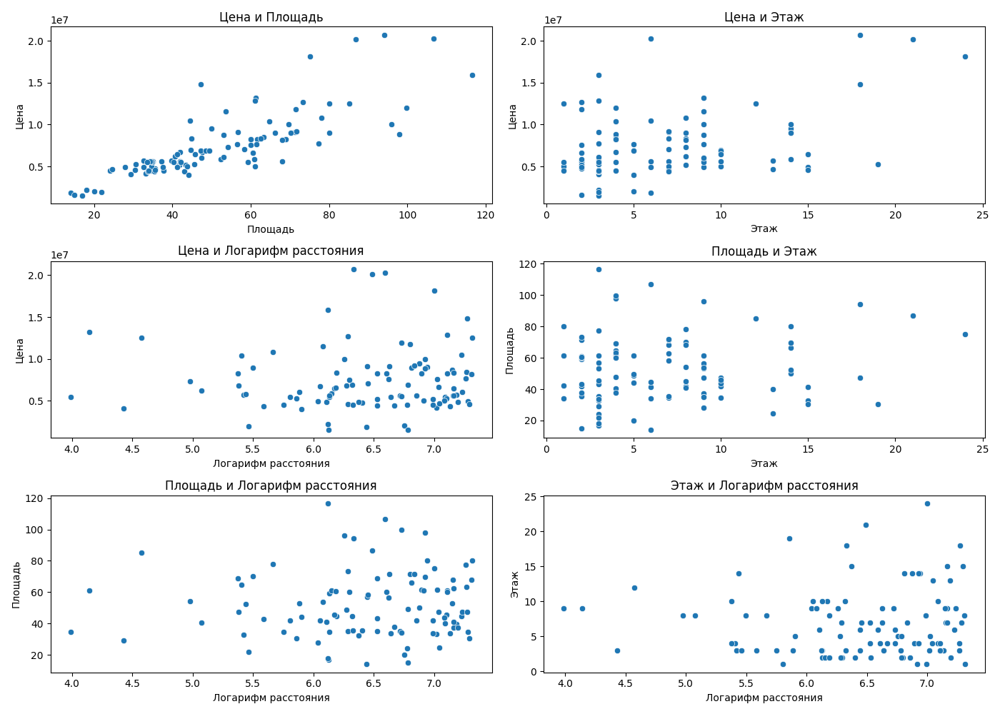

# Анализ стоимости недвижимости в г.Барнаул

Проект был разработан студентом гр.Б22-191-1з Афанасьевым П.Ю. в рамках учебной практики "Уч. практика_НИР"..

Этот проект включает два скрипта:

1. **Парсинг данных с сайта Avito:** с использованием Selenium, данные о недвижимости (цена, метраж, этаж и т.д.) извлекаются и сохраняются в базу данных SQLite.

> [!IMPORTANT]  
> Более простой способ парсинга данных расписан [тут](https://github.com/AniCatPro/CIAN-Parser/tree/main). 
  
2. **Анализ данных:** данные анализируются с использованием Pandas и Scikit-learn для построения линейной регрессии и других статистических тестов.

> [!TIP]
> Ознакомиться с отчетом анализа данных можно [тут](https://github.com/AniCatPro/NIR/blob/master/%D0%9E%D1%82%D1%87%D0%B5%D1%82%20%D0%9D%D0%98%D0%A0%20%D0%90%D1%84%D0%B0%D0%BD%D0%B0%D1%81%D1%8C%D0%B5%D0%B2.pdf).

## Основные функции

- **Парсинг данных:** сбор информации о недвижимости с платформы Avito и сохранение в SQLite.
- **Анализ данных:** включает обработку данных, статистический анализ и построение моделей машинного обучения для оценки факторов, влияющих на стоимость недвижимости.
- **Визуализация:** предоставляет графики и диаграммы для лучшего понимания распределений и зависимостей в данных.

## Структура базы данных

- **properties** — таблица данных о недвижимости:
  - **id** — уникальный идентификатор записи.
  - **price** — цена недвижимости.
  - **total_area** — общая площадь.
  - **living_area** — жилая площадь.
  - **rooms** — количество комнат.
  - **floor** — этаж.
  - **total_floors** — всего этажей в здании.
  - **year** — год постройки.
  - **balcony** — наличие балкона.
  - **condition** — состояние жилья.
  - **type** — тип недвижимости.
  - **district** — район.
  - **url** — ссылка на объявление.

## Установка

1. Клонируйте репозиторий:
    ```bash
    git clone https://github.com/AniCatPro/NIR.git
    ```

2. Перейдите в каталог проекта:
    ```bash
    cd NIR
    ```

3. Установите необходимые зависимости:
    ```bash
    pip install pandas numpy scikit-learn scipy matplotlib seaborn statsmodels ipython selenium webdriver-manager
    ```

4. Запустите парсинг данных:
    ```bash
    python pars_sql.py
    ```

5. Запустите анализ данных:
    ```bash
    python test2.py
    ```


## Визуализация данных

### Гистограммы


### Матрица корреляций


### Проведение корреляционного анализа и его визуализация


###  Прогнозные vs. Фактические значения


###  Гистограмма ошибок

